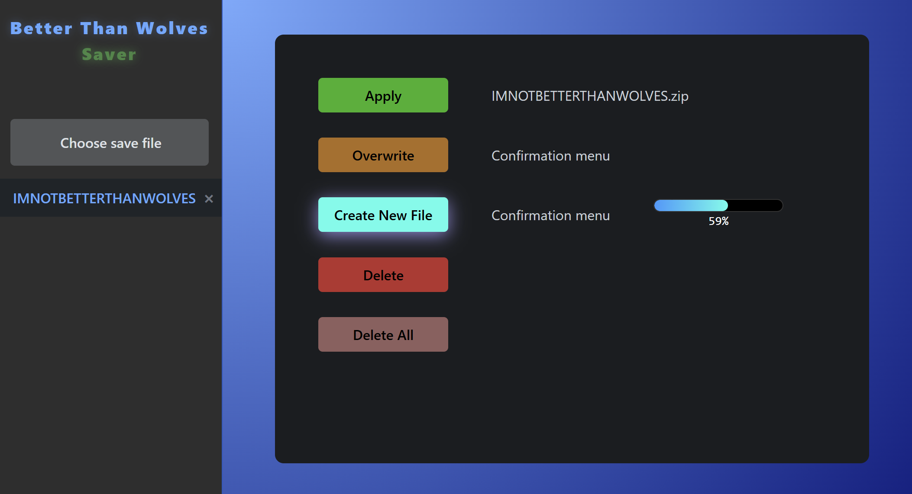



A lightweight, asynchronous backup manager for Minecraft worlds (originally created for the Better Than Wolves modification).

BTWSaver solves the "death-reset" anxiety by providing a robust, multi-threaded GUI to manage world saves. It allows players to create backups, overwrite existing saves, and restore worlds instantly—all while ensuring the UI remains responsive during heavy file operations.

🚀 Features
Asynchronous Processing: Built with C# Task.Run and IProgress<int> to ensure zero UI freezing during zip/unzip operations.

Versioned Backups: Automatically detects the last backup index.

Cross-Component Communication: Implements a custom Event Beacon architecture (Publish-Subscribe) to sync state between UI layouts and home views.

Real-time Progress: Live progress bars for zipping, unzipping, and applying back-ups.

Dynamic World Selection: Integrated folder picker that updates the entire application state on selection.

🛠️ Technical Stack
Framework: .NET MAUI / Blazor Hybrid

Language: C#

Storage: JSON-based configuration management

📂 Installation & Usage
Select World: Click the folder icon to point the app to your .minecraft/saves folder.

Create New: Generates a new .zip backup with an auto-incrementing index.

Overwrite: Replaces the current selected backup with your latest save state.

Apply: Wipes the current world folder and unzips the selected backup back into the game directory.